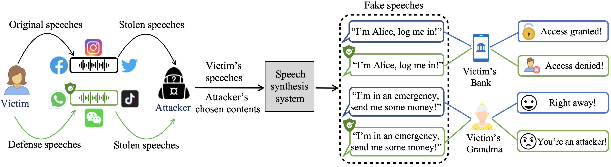

# Protecting Your Voice From Speech Synthesis Attacks.

This repository hosts the codes of our project, “Protecting Your Voice From Speech Synthesis Attacks.” We modify speeches in the frequency domains to avoid one’s voice getting cloned by speech synthesis systems, preventing improper usage in Voicer conversion (VC)  and Text-to-speech (TTS).
Here's our defense scheme figure.



# What does this repository contain?

- Data processing of audio files

- How we modify speech samples with proposed three modification methods in the frequency domain:
  - Zero Mask
  - AN-Mask
  - GB-Mask

- How we iteratively find the optimum frequency-modification pairs.

- How we protect a single speech (SampleMask).

- How we protect arbitrary speeches of a speaker (SpeakerMask).

- Examples of running a defense.

# Setup of the project.

Since many audio-based libraries require specific versions, we recommend setting up the environments by running:

```bash
example bash
```

# Examples of running defense.

To perform the defense toward a target speech sample:

```bash
python main.py --sid 005 --tau 0.06 --eps 0.1 --ksize 11 --std 1.5 --b_num 16
```

To perform the defense toward arbitary speech samples of a speaker:
```bash
python main.py --sid 005 --tau 0.06 --eps 0.1 --ksize 11 --std 1.5 --b_num 16
```

Evaluate the defense Effects:
```bash
example bash
```


# Integration Tips

Our defense scheme supports any black-box speech synthesis systems. If you would like to try more speech synthesis systems, we recommend using general functions to represent VC models and TTS models 
so that they can easily combine with our defense scheme; we also encourage later works to explore more potential modification methods in the frequency domains.

# Reference
For pretrain the speech synthesis systems, you can refer to the [Chou’s](https://arxiv.org/abs/1904.05742), [AutoVC](https://arxiv.org/abs/1905.05879), and [SV2TTS](https://arxiv.org/abs/1806.04558), the original papers. For the Attack-VC (the baseline in our paper), please refer to their [paper](https://arxiv.org/abs/2005.08781). In his repository, we provide example audio files for quickly run the codes. The full dataset we used in the paper, CSTR VCTK, is public avaliable and can be found [here](https://datashare.ed.ac.uk/handle/10283/3443).


Parts of our codebase were inspired by or adapted from the following repositories:

- [**attack-vc**](https://github.com/cyhuang-tw/attack-vc) 
- [**AutoVC**](https://github.com/cyhuang-tw/AutoVC) 
- [**Real-Time-Voice-Cloning**](https://github.com/CorentinJ/Real-Time-Voice-Cloning)

We thank the authors of these repositories for making their code available to the community.


